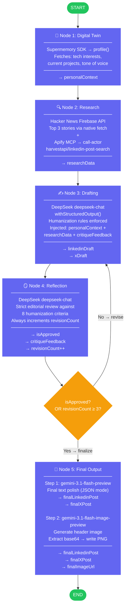
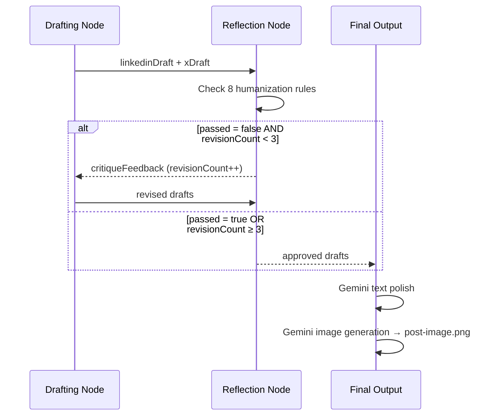

# Content Agent

A stateful, autonomous AI content generation agent built with **LangGraph.js**. It researches trending topics, writes personalized LinkedIn and X posts in your voice, self-critiques them in a reflection loop, and generates a matching header image — all in a single graph invocation.

---

## How It Works



### Reflection Loop Detail

The agent self-critiques and rewrites until quality passes — with a hard cap at 3 cycles:



---

## Tech Stack

| Layer | Technology |
|---|---|
| Orchestration | [LangGraph.js](https://langchain-ai.github.io/langgraphjs/) (`@langchain/langgraph`) |
| Drafting & Reflection LLM | [DeepSeek](https://www.deepseek.com/) via `@langchain/deepseek` — `deepseek-chat` |
| Final Output LLM | [Google Gemini](https://ai.google.dev/) via `@google/genai` — `gemini-3.1-flash-preview` |
| Image Generation | Google Gemini via `@google/genai` — `gemini-3.1-flash-image-preview` |
| Personal Memory | [Supermemory](https://supermemory.ai/) SDK — direct REST API |
| Web Research | [Apify](https://apify.com/) via MCP — `harvestapi/linkedin-post-search` actor |
| HN Research | [Hacker News Firebase API](https://hacker-news.firebaseio.com/) — native `fetch` |
| MCP Transport | `@langchain/mcp-adapters` + `@modelcontextprotocol/sdk` |
| Runtime | Node.js 22 + TypeScript (strict, NodeNext ESM) |
| Schema Validation | Zod |

---

## Project Structure

```
content-agent/
├── src/
│   ├── config/
│   │   └── env.ts              # Zod-validated env vars — single source of truth
│   ├── state/
│   │   └── schema.ts           # LangGraph Annotation.Root state + Zod output schemas
│   ├── mcp/
│   │   └── client.ts           # Apify MCP client (MultiServerMCPClient)
│   ├── nodes/
│   │   ├── digitalTwin.ts      # Node 1 — Supermemory profile fetch
│   │   ├── research.ts         # Node 2 — HN fetch + Apify LinkedIn search
│   │   ├── drafting.ts         # Node 3 — DeepSeek structured draft generation
│   │   ├── reflection.ts       # Node 4 — DeepSeek editorial critique
│   │   └── finalOutput.ts      # Node 5 — Gemini text polish + image generation
│   ├── agent/
│   │   └── workflow.ts         # StateGraph assembly + conditional edge logic
│   ├── index.ts                # Entry point
│   └── test.ts                 # Modular integration test runner
├── .env                        # API keys (never commit this)
├── package.json
├── tsconfig.json
└── post-image.png              # Generated after a run (git-ignored)
```

---

## State Schema

All fields use a **last-write-wins** reducer. Each node returns only the fields it modifies; LangGraph merges them into the running state.

```
AgentState
├── personalContext    string   — Digital Twin data from Supermemory
├── researchData       string   — Aggregated HN + LinkedIn research brief
├── linkedinDraft      string   — Current draft (updated on each revision)
├── xDraft             string   — Current X draft, max 280 chars
├── revisionCount      number   — Incremented by Reflection node (default: 0)
├── critiqueFeedback   string   — Reflection node's specific critique for next revision
├── isApproved         boolean  — Reflection verdict (default: false)
├── finalLinkedinPost  string   — Gemini-polished LinkedIn post
├── finalXPost         string   — Gemini-polished X post
└── finalImageUrl      string   — Path to generated PNG (e.g. "post-image.png")
```

---

## Prerequisites

- **Node.js 22+**
- **npm 10+**
- API keys for: DeepSeek, Google Gemini, Supermemory, Apify

---

## Setup

### 1. Clone and install

```bash
git clone https://github.com/your-username/content-agent.git
cd content-agent
npm install
```

### 2. Configure environment

Create a `.env` file in the project root:

```bash
DEEPSEEK_API_KEY=your_deepseek_key
GEMINI_API_KEY=your_gemini_key
SUPERMEMORY_API_KEY=your_supermemory_key
APIFY_TOKEN=your_apify_token

# Optional: scope your memory to a custom container tag (default: "content-agent-user")
SUPERMEMORY_CONTAINER_TAG=content-agent-user
```

| Variable | Where to get it |
|---|---|
| `DEEPSEEK_API_KEY` | [platform.deepseek.com](https://platform.deepseek.com) |
| `GEMINI_API_KEY` | [aistudio.google.com](https://aistudio.google.com/apikey) |
| `SUPERMEMORY_API_KEY` | [console.supermemory.ai](https://console.supermemory.ai) |
| `APIFY_TOKEN` | [console.apify.com/account/integrations](https://console.apify.com/account/integrations) |

### 3. Seed your Supermemory (recommended)

The Digital Twin node reads your personal context from Supermemory. Add some memories about yourself before the first run using the [Supermemory console](https://console.supermemory.ai) or their API. Examples:

- Your tech stack and interests
- Your communication style and tone preferences
- Current projects you're working on

Without any memories, the agent falls back to a generic writing tone.

---

## Running

```bash
# Development (runs TypeScript directly, no compile step)
npm run dev

# Production (compile first, then run)
npm run build
npm start
```

### What you get after a run

```
=== FINAL OUTPUT ===

--- LinkedIn Post ---
[150-300 word post in your voice]

--- X Post ---
[max 280 char post]

--- Image ---
Saved to: post-image.png

--- Stats ---
Revision cycles: 2
Approved by reflection: true
```

`post-image.png` is written to the project root.

---

## Testing

Tests are organized into isolated sections — run them individually to pinpoint failures fast.

```bash
# 1. Fast — env vars + import check (no API calls, ~1s)
npm run test:env

# 2. Supermemory SDK — profile() call against real API
npm run test:memory

# 3. Apify MCP — server starts and returns tools
npm run test:mcp

# 4. Hacker News — Firebase API fetch (no API key needed)
npm run test:hn

# 5. DeepSeek — Drafting + Reflection with fixture state (no MCP)
npm run test:draft

# 6. Full pipeline — all nodes, MCP, Gemini image gen
npm run test:pipeline

# All sections in sequence with a summary
npm run test
```

### Test output format

```
──────────────────────────────────────────────────────────────
  SECTION 3 — Apify MCP Connectivity
──────────────────────────────────────────────────────────────
  ✓ PASS  initializeConnections() — Apify MCP server starts (4821ms)
           Apify MCP process started.
  ✓ PASS  Apify tools load (>= 1 tool) (312ms)
           3 tool(s): call-actor, get-actor-run, ...
```

Failures show the exact error message and a stack trace excerpt so you know immediately what broke and where.

### Type checking

```bash
npm run typecheck
```

---

## Node Reference

### Node 1 — Digital Twin
**Integration:** Supermemory SDK (`supermemory` npm package, direct REST API — no MCP)

Calls `client.profile({ containerTag, q })` to retrieve the user's memory profile:
- `profile.static` — long-term facts (interests, expertise, communication style)
- `profile.dynamic` — recent activity and current focus

The result is formatted into `personalContext` and injected into every downstream prompt. No LLM is involved — Supermemory handles profiling server-side.

### Node 2 — Research
**Integrations:** Hacker News Firebase API (native `fetch`) + Apify MCP (`harvestapi/linkedin-post-search`)

Runs two data sources in sequence:
1. Fetches top 3 HN story titles and scores
2. Uses a DeepSeek ReAct agent with Apify tools to run `harvestapi/linkedin-post-search` with queries `["AI Agents", "Node.js"]`, past week, top 3 posts by relevance

The ReAct agent summarizes both sources into a single `researchData` string.

### Node 3 — Drafting
**Integration:** DeepSeek `deepseek-chat` with `withStructuredOutput()`

Writes two posts simultaneously using 8 strict humanization rules:

| Rule | Detail |
|---|---|
| No em dashes | Use commas, periods, or line breaks |
| Sentence variance | Mix short (< 5 words) and long sentences |
| First-person | "I" or "we" throughout |
| Direct opener | No "In today's world..." or "As we navigate..." |
| Banned words | delve, leverage, tapestry, transformative, seamlessly, and 9 more |
| Tone match | Aligned to `personalContext` |
| LinkedIn format | 150–300 words, hook on line 1, max 3 hashtags |
| X format | Strictly ≤ 280 characters |

On revision passes, `critiqueFeedback` from the previous reflection cycle is injected into the prompt.

### Node 4 — Reflection
**Integration:** DeepSeek `deepseek-chat` (temperature 0.1 for deterministic critique)

Acts as a strict editor. Evaluates both drafts against all 8 rules and returns:
- `passed: boolean` — `true` only if every rule passes
- `feedback: string` — names the exact violation and the offending sentence

Always increments `revisionCount`. The conditional edge reads this updated value to decide whether to loop back to drafting or proceed.

### Node 5 — Final Output
**Integration:** Google Gemini via `@google/genai` SDK (direct, not via LangChain)

**Step 1 — Text polish:** `gemini-3.1-flash-preview` with `responseMimeType: "application/json"` does a light formatting pass and returns `{ finalLinkedinPost, finalXPost }`.

**Step 2 — Image generation:** `gemini-3.1-flash-image-preview` with `responseModalities: ["IMAGE", "TEXT"]` generates a header image. The `inlineData.data` (base64) from the response is decoded and written to `post-image.png`.

---

## Architecture Notes

**Why two different LLM providers?**
DeepSeek (`deepseek-chat`) is cost-efficient and fast for structured text tasks like drafting and reflection. Gemini is used for the final pass because of its native JSON output mode and multimodal image generation capability.

**Why Supermemory SDK instead of MCP?**
Supermemory does not publish an MCP server. Their integration is the `supermemory` npm package (a REST SDK). Using it directly is simpler and more reliable than routing through an MCP proxy.

**Why Apify via MCP?**
Apify's actor catalog is dynamic and maps naturally to MCP tools. The `@apify/actors-mcp-server` package is published and maintained by Apify, providing access to hundreds of scraping actors as callable tools without manual API wiring.

**ESM + NodeNext**
The project uses `"type": "module"` and `"moduleResolution": "NodeNext"`. All local imports use `.js` extensions (TypeScript resolves these to `.ts` at compile time). Node built-ins use the `node:` prefix.

---

## Environment Variables Reference

| Variable | Required | Default | Description |
|---|---|---|---|
| `DEEPSEEK_API_KEY` | Yes | — | DeepSeek API key for drafting and reflection |
| `GEMINI_API_KEY` | Yes | — | Google Gemini API key for final output and image gen |
| `SUPERMEMORY_API_KEY` | Yes | — | Supermemory key for personal memory profile |
| `APIFY_TOKEN` | Yes | — | Apify token for LinkedIn post search actor |
| `SUPERMEMORY_CONTAINER_TAG` | No | `content-agent-user` | Scopes your memory space |

---

## License

ISC
