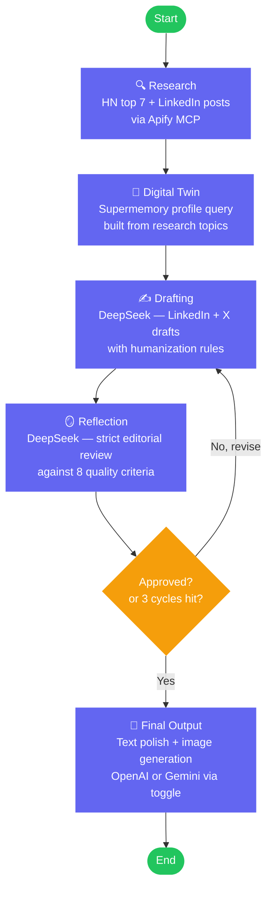
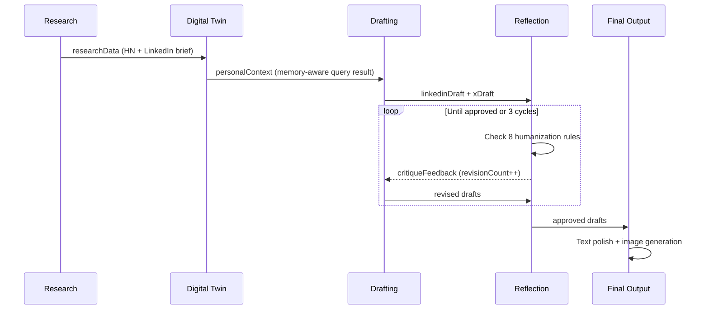

# Content Agent

A stateful, autonomous AI content generation agent built with **LangGraph.js**. It researches trending topics, writes personalized LinkedIn and X posts in your voice, self-critiques them in a reflection loop, and generates a matching header image — all in a single graph invocation.

---

## How It Works



### Reflection Loop

The agent self-critiques and rewrites until quality passes — with a hard cap at 3 cycles:



---

## Tech Stack

| Layer | Technology |
|---|---|
| Orchestration | LangGraph.js (`@langchain/langgraph`) |
| Research LLM | OpenAI `gpt-5.4` via `@langchain/openai` — ReAct agent over Apify tools |
| Drafting & Reflection | DeepSeek `deepseek-chat` via `@langchain/deepseek` |
| Final Output — OpenAI path | `gpt-4o` (text) + `gpt-image-1-mini` (image) |
| Final Output — Gemini path | Vertex AI `gemini-3.1-flash-preview` (text) + `gemini-3.1-flash-image-preview` (image) |
| Personal Memory | Supermemory SDK (`supermemory` npm package) |
| LinkedIn Research | Apify MCP — `harvestapi/linkedin-post-search` actor |
| HN Research | Hacker News Firebase API — native `fetch`, top 7 stories |
| MCP Transport | `@langchain/mcp-adapters` + `@modelcontextprotocol/sdk` |
| Runtime | Node.js 22 + TypeScript (strict, NodeNext ESM) |
| Schema Validation | Zod |

---

## Project Structure

```
content-agent/
├── src/
│   ├── config/
│   │   └── env.ts              # Zod-validated env vars — single source of truth
│   ├── state/
│   │   └── schema.ts           # LangGraph Annotation.Root state + Zod output schemas
│   ├── mcp/
│   │   └── client.ts           # Apify MCP client (MultiServerMCPClient)
│   ├── nodes/
│   │   ├── research.ts         # Node 1 — HN fetch + Apify LinkedIn search
│   │   ├── digitalTwin.ts      # Node 2 — Supermemory context-aware profile fetch
│   │   ├── drafting.ts         # Node 3 — DeepSeek structured draft generation
│   │   ├── reflection.ts       # Node 4 — DeepSeek editorial critique
│   │   └── finalOutput.ts      # Node 5 — Text polish + image generation (OpenAI or Gemini)
│   ├── agent/
│   │   └── workflow.ts         # StateGraph assembly + conditional edge logic
│   ├── index.ts                # Basic entry point
│   ├── run.ts                  # Pipeline runner — saves full JSON snapshot to output/
│   ├── test.ts                 # Modular integration test runner
│   └── test-image.ts           # Standalone image generation test
├── output/                     # JSON run snapshots (git-ignored)
├── .example.env                # Environment variable template
├── package.json
└── tsconfig.json
```

---

## State Schema

All fields use a **last-write-wins** reducer. Each node returns only the fields it modifies.

```
AgentState
├── researchData       string   — HN + LinkedIn research brief (set by Research node)
├── personalContext    string   — Memory profile queried against research topics
├── linkedinDraft      string   — Current draft (updated on each revision)
├── xDraft             string   — Current X draft (≤ 280 chars, enforced by reflection)
├── revisionCount      number   — Incremented by Reflection on every cycle
├── critiqueFeedback   string   — Specific critique for the next revision pass
├── isApproved         boolean  — Reflection verdict
├── finalLinkedinPost  string   — Polished LinkedIn post
├── finalXPost         string   — Polished X post
└── finalImageUrl      string   — Path to generated PNG ("post-image.png")
```

---

## Setup

### 1. Install

```bash
git clone https://github.com/your-username/content-agent.git
cd content-agent
npm install
```

### 2. Configure environment

Copy `.example.env` to `.env` and fill in your values:

```bash
# Required
DEEPSEEK_API_KEY=your_deepseek_key
OPENAI_API_KEY=your_openai_key
SUPERMEMORY_API_KEY=your_supermemory_key
APIFY_TOKEN=your_apify_token

# Optional — defaults to "openai"
FINAL_OUTPUT_PROVIDER=openai

# Required only when FINAL_OUTPUT_PROVIDER=gemini
# GOOGLE_APPLICATION_CREDENTIALS=./gemini_cred.json
# GOOGLE_PROJECT_ID=your_gcp_project_id
```

| Variable | Required | Description |
|---|---|---|
| `DEEPSEEK_API_KEY` | Yes | Drafting and reflection nodes |
| `OPENAI_API_KEY` | Yes | Research node (gpt-5.4) + Final Output when provider=openai |
| `SUPERMEMORY_API_KEY` | Yes | Personal memory profile fetch |
| `APIFY_TOKEN` | Yes | LinkedIn post scraping via MCP |
| `FINAL_OUTPUT_PROVIDER` | No | `openai` (default) or `gemini` |
| `GOOGLE_APPLICATION_CREDENTIALS` | If gemini | Path to GCP service account JSON |
| `GOOGLE_PROJECT_ID` | If gemini | GCP project with Vertex AI enabled |
| `SUPERMEMORY_CONTAINER_TAG` | No | Scopes the profile query to your memory space. Find it in the Supermemory dashboard. Defaults to `""` (queries across all containers). |

### 3. Seed your Supermemory

The Digital Twin node queries your Supermemory profile using the day's research topics. Add memories about yourself via the [Supermemory console](https://console.supermemory.ai):

- Your tech stack and interests
- Your communication style and tone
- Current projects you're working on

Without any memories, the agent falls back to a generic writing tone.

---

## Running

```bash
# Full pipeline — saves JSON snapshot to output/
npm run pipeline

# Basic run — logs to console only
npm run dev

# Standalone image generation test
npm run test:image
```

### Output

After a run, `output/run-<timestamp>.json` contains:

```json
{
  "meta": { "durationMs": 59000, "revisionCycles": 2, "approvedByReflection": true },
  "personalContext": "...",
  "research": { "brief": "..." },
  "drafts": { "linkedin": "...", "x": "..." },
  "reflection": { "approved": true, "lastFeedback": "..." },
  "finalOutput": { "linkedinPost": "...", "xPost": "...", "imagePath": "post-image.png" }
}
```

`post-image.png` is written to the project root.

---

## Testing

```bash
npm run test:env       # Env vars + import check (~1s, no API calls)
npm run test:memory    # Supermemory SDK profile() call
npm run test:mcp       # Apify MCP server starts and returns tools
npm run test:hn        # Hacker News Firebase API fetch
npm run test:draft     # DeepSeek drafting + reflection with fixture state
npm run test:pipeline  # Full end-to-end pipeline
npm run test           # All sections in sequence
npm run typecheck      # TypeScript type check only
```

---

## Node Reference

### Node 1 — Research
Runs two data sources in sequence:
1. Fetches the top **7** HN story titles and scores via the Firebase API
2. Uses a GPT-5.4 ReAct agent with Apify MCP tools to call `harvestapi/linkedin-post-search` — queries `["AI Agents", "Node.js"]`, past week, sorted by relevance

The agent summarizes both into a single `researchData` string passed to all downstream nodes.

### Node 2 — Digital Twin
Queries Supermemory using a **dynamic query built from the research brief** — so the profile response surfaces opinions and context directly relevant to today's topics, not a generic profile.

Calls `client.profile({ q })` which returns:
- `profile.static` — long-term facts (interests, expertise, communication style)
- `profile.dynamic` — recent activity and current focus

No LLM involved — Supermemory handles profiling server-side.

### Node 3 — Drafting
DeepSeek `deepseek-chat` with `withStructuredOutput()` writes both posts simultaneously enforcing 8 humanization rules:

| Rule | Detail |
|---|---|
| No em dashes | Use commas, periods, or line breaks |
| Sentence variance | Mix short (< 5 words) and long sentences |
| First-person | "I" or "we" throughout |
| Direct opener | No "In today's world..." or "As we navigate..." |
| Banned words | delve, leverage, tapestry, transformative, seamlessly, and 9 more |
| Tone match | Aligned to `personalContext` |
| LinkedIn format | 150–300 words, hook on line 1, max 3 hashtags |
| X format | Strictly ≤ 280 characters |

On revision passes, `critiqueFeedback` from the previous reflection cycle is injected into the prompt.

### Node 4 — Reflection
DeepSeek `deepseek-chat` at temperature 0.1 (deterministic critique). Evaluates both drafts against all 8 rules and returns:
- `passed: boolean` — `true` only if every rule passes across both drafts
- `feedback: string` — names the exact violation and the offending sentence

Always increments `revisionCount`. The conditional edge fires `finalOutput` if `isApproved` or `revisionCount >= 3`.

### Node 5 — Final Output
Provider selected by `FINAL_OUTPUT_PROVIDER` env var:

| | OpenAI (default) | Gemini |
|---|---|---|
| Text polish | `gpt-4o` + JSON mode | `gemini-3.1-flash-preview` via Vertex AI |
| Image | `gpt-image-1-mini` | `gemini-3.1-flash-image-preview` via Vertex AI |
| Auth | `OPENAI_API_KEY` | Service account via `GOOGLE_APPLICATION_CREDENTIALS` |

---

## Architecture Notes

**Why research runs before Digital Twin?**
The Supermemory query is built from the actual research topics found that day, so the profile response surfaces opinions and past thoughts relevant to what's being written — not a generic personality snapshot.

**Why DeepSeek for drafting and reflection?**
Cost-efficient and fast for structured text tasks. The `withStructuredOutput()` pattern with named function calls works reliably with DeepSeek's OpenAI-compatible API.

**Why Supermemory SDK instead of MCP?**
Supermemory does not publish an MCP server. The `supermemory` npm package is their official integration path.

**Why Apify via MCP?**
Apify's actor catalog is dynamic and maps naturally to MCP tools. The `@apify/actors-mcp-server` exposes hundreds of scraping actors as callable tools without manual API wiring.

**ESM + NodeNext**
All local imports use `.js` extensions (TypeScript resolves these to `.ts` at compile time). Node built-ins use the `node:` prefix.

---

## License

ISC
